```mermaid
---
title: MUSIC directory schema (Version 2.0)
---
flowchart LR
    root[/"`**.**
    *(root directory in globus)*`"/] --> meta["`**music_metadata.tsv**
    *may be reorganized from upload*`"]
    root --> c["`**contributors.tsv**
    *may be reorganized from upload*`"]
    
    root --> ex[/"`**extras/**`"/] 

    root --> raw[/"`**raw/**`"/]
    raw --> fastq[/"`**fastq/**`"/]
    fastq --> gz["`**…_R… .fastq.gz**`"]

    root --> lp[/"`**lab_processed/**`"/]
    lp --> lpfastq[/"`**fastq/**`"/]
    lpfastq --> dna[/"`**DNA/**`"/]
    dna --> dnagz["`**… .fastq.gz**`"]
    lpfastq --> rna[/"`**RNA/**`"/]
    rna --> rnagz["`**… .fastq.gz**`"]

    classDef default fill:#FFFFFF,color:#000;
    classDef opt fill:#E9E9E9,color:#000;
```

Prepare your metadata based on the latest metadata schema using one of the template files below. See the instructions in the [Metadata Validation Workflow](https://docs.google.com/document/d/1lfgiDGbyO4K4Hz1FMsJjmJd9RdwjShtJqFYNwKpbcZY) document for more information on preparing and validating your metadata.tsv file prior to submission.

Related files:

- [📝 Excel template](https://raw.githubusercontent.com/hubmapconsortium/dataset-metadata-spreadsheet/main/music/latest/music.xlsx): For metadata entry.
- [📝 TSV template](https://raw.githubusercontent.com/hubmapconsortium/dataset-metadata-spreadsheet/main/music/latest/music.tsv): Alternative for metadata entry.

## Metadata schema

<a href="https://openview.metadatacenter.org/templates/https:%2F%2Frepo.metadatacenter.org%2Ftemplates%2F5efe0d51-828c-457a-9b94-2ac8090fe14f"><b>Version 2 (use this one)</b></a>

 

## Directory schemas

<b>Version 2.0 (use this one)</b>

| pattern | required? | description |
| --- | --- | --- |
| <code>extras\/.*</code> | ✓ | Folder for general lab-specific files related to the dataset. |
| <code>raw\/.*</code> | ✓ | All raw data files for the experiment. |
| <code>raw\/fastq\/.*</code> | ✓ | Raw sequencing files for the experiment. |
| <code>raw\/fastq\/[^\/]+_R[^\/]+\.fastq\.gz</code> | ✓ | The raw un-multiplexed fastq files. |
| <code>lab_processed\/.*</code> | ✓ | Experiment files that were processed by the lab generating the data. |
| <code>lab_processed\/fastq\/DNA\/.*</code> | ✓ | Directory containing fastq files pertaining to whole genome sequencing. |
| <code>lab_processed\/fastq\/DNA\/[^\/]+\.fastq\.gz</code> | ✓ | This is a GZip'd version of the fastq files from whole genome sequencing. |
| <code>lab_processed\/fastq\/RNA\/.*</code> | ✓ | Directory containing fastq files pertaining to RNAseq sequencing. |
| <code>lab_processed\/fastq\/RNA\/[^\/]+\.fastq\.gz</code> | ✓ | This is a GZip'd version of the forward and reverse fastq files from RNAseq sequencing (R1 and R2). |

