```mermaid
---
title: PhenoCycler directory schema (Version 2.0)
---
flowchart LR
    root[/"`**.**
    *(root directory in globus)*`"/] --> meta["`**phenocycler_metadata.tsv**
    *may be reorganized from upload*`"]
    root --> c["`**contributors.tsv**
    *may be reorganized from upload*`"]
    
    root --> ex[/"`**extras/**`"/] 

    root --> raw[/"`**raw/**`"/]
    raw --> rawi[/"`**images/**`"/]
    rawi --> xpd["`**… .xpd**`"]
    rawi --> qptiff["`**… .qptiff**`"]
    rawi --> phe[/"`**phenocycler/**`"/]
    phe --> pheqptiff["`**… .qptiff.raw**`"]
    phe --> int["`… .qptiff.intermediate
    *optional*`"]:::opt
    phe --> etc["`*one of:*
    **CombineInputs.txt
    FocusMap.tif
    FocusTable.txt
    Label.tif
    MarkerList.txt
    OverviewBF.tif
    SampleMask.tif**`"]
    phe --> etco["`*any / all of:*
    CoverslipMask.tif
    FlowCellOverview.tif
    OverviewFL.tif
    SampleValMask.tif
    *optional*`"]:::opt

    root --> lp[/"`**lab_processed/**`"/]
    lp --> lpi[/"`**images/**`"/]
    lpi --> chan["`**…qptiff.channels.csv**`"]
    lpi --> tb["`tissue-boundary.geojson
    *optional*`"]:::opt

    classDef default fill:#FFFFFF,color:#000;
    classDef opt fill:#E9E9E9,color:#000;
```

Prepare your metadata based on the latest metadata schema using one of the template files below. See the instructions in the [Metadata Validation Workflow](https://docs.google.com/document/d/1lfgiDGbyO4K4Hz1FMsJjmJd9RdwjShtJqFYNwKpbcZY) document for more information on preparing and validating your metadata.tsv file prior to submission.

Related files:

- [📝 Excel template](https://raw.githubusercontent.com/hubmapconsortium/dataset-metadata-spreadsheet/main/phenocycler/latest/phenocycler.xlsx): For metadata entry.
- [📝 TSV template](https://raw.githubusercontent.com/hubmapconsortium/dataset-metadata-spreadsheet/main/phenocycler/latest/phenocycler.tsv): Alternative for metadata entry.

## Metadata schema

<a href="https://openview.metadatacenter.org/templates/https:%2F%2Frepo.metadatacenter.org%2Ftemplates%2F62af6829-743d-423e-a701-204710e56beb"><b>Version 2 (use this one)</b></a>

 

## Directory schemas

<b>Version 2.0 (use this one)</b>

| pattern | required? | description |
| --- | --- | --- |
| <code>extras\/.*</code> | ✓ | Folder for general lab-specific files related to the dataset. [Exists in all assays] |
| <code>extras\/microscope_hardware\.json</code> | ✓ | **[QA/QC]** A file generated by the micro-meta app that contains a description of the hardware components of the microscope. Email HuBMAP Consortium Help Desk <help@hubmapconsortium.org> if help is required in generating this document. |
| <code>extras\/microscope_settings\.json</code> |  | **[QA/QC]** A file generated by the micro-meta app that contains a description of the settings that were used to acquire the image data. Email HuBMAP Consortium Help Desk <help@hubmapconsortium.org> if help is required in generating this document. |
| <code>raw\/.*</code> | ✓ | This is a directory containing raw data. |
| <code>raw\/images\/.*</code> | ✓ | Raw image files. Using this subdirectory allows for harmonization with other more complex assays, like Visium that includes both raw imaging and sequencing data. |
| <code>raw\/images\/[^\/]+\.xpd</code> | ✓ | Experimental set up of the Phenocycler-Fusion run. File includes cycle information, antibodies utilized, and the experimental design of the run |
| <code>raw\/images\/[^\/]+\.qptiff</code> | ✓ | Final image file produced by the Phenocycler-Fusion |
| <code>raw\/images\/phenocycler\/.*</code> | ✓ | These are the files from the temp directory generated by the PhenoCycler. The dataset should include all files from this directory except the "qptiff.intermediate" files. |
| <code>raw\/images\/phenocycler\/[^\/]+\.qptiff\.raw</code> | ✓ | Raw image files from the temp directory generated by the PhenoCycler. |
| <code>raw\/images\/phenocycler\/[^\/]+\.qptiff\.intermediate</code> |  | Intermediate image files from the temp directory generated by the PhenoCycler. These files are not required. |
| <code>raw\/images\/phenocycler\/(?:CombineInputs.txt&#124;FocusMap.tif&#124;FocusTable.txt&#124;Label.tif&#124;MarkerList.txt&#124;OverviewBF.tif&#124;SampleMask.tif)</code> | ✓ | Required file from the temp directory generated by the PhenoCycler. The optional files depend on which version of the PhenoCycler software was being used. |
| <code>raw\/images\/phenocycler\/(?:CoverslipMask.tif&#124;FlowCellOverview.tif&#124;OverviewFL.tif&#124;SampleValMask.tif)</code> |  | Required file from the temp directory generated by the PhenoCycler. The optional files depend on which version of the PhenoCycler software was being used. |
| <code>lab_processed\/.*</code> | ✓ | Experiment files that were processed by the lab generating the data. |
| <code>lab_processed\/images\/.*</code> | ✓ | This is a directory containing processed image files |
| <code>lab_processed\/images\/[^\/]+tissue-boundary\.geojson</code> |  | **[QA/QC]** If the boundaries of the tissue have been identified (e.g., by manual efforts), then the boundary geometry can be included as a GeoJSON file named “*.tissue-boundary.geojson”. |
| <code>lab_processed\/images\/[^\/]*qptiff\.channels\.csv</code> | ✓ | This file provides essential documentation pertaining to each channel of the accommpanying QPTIFF. The file should contain one row per QPTIFF channel. The required fields are detailed <https://docs.google.com/spreadsheets/d/1JikzRNyDErspgPSel4P9Y6gx6N_mrAGIMDcJZd8TucA/edit#gid=0> |

